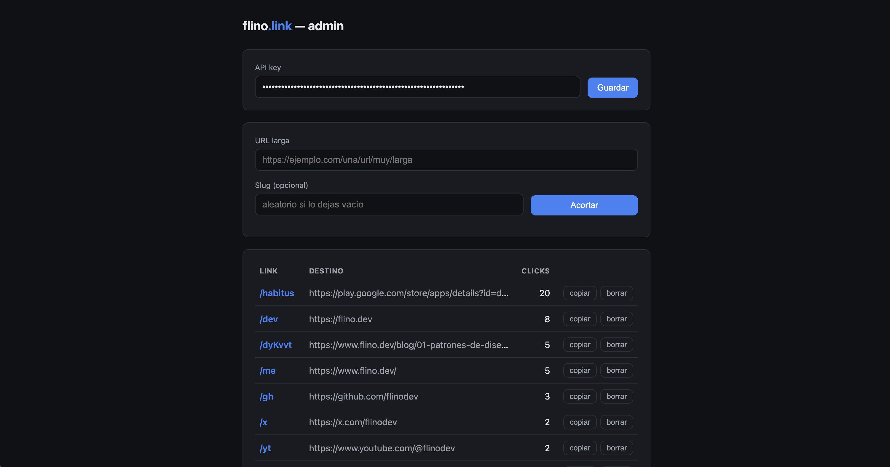
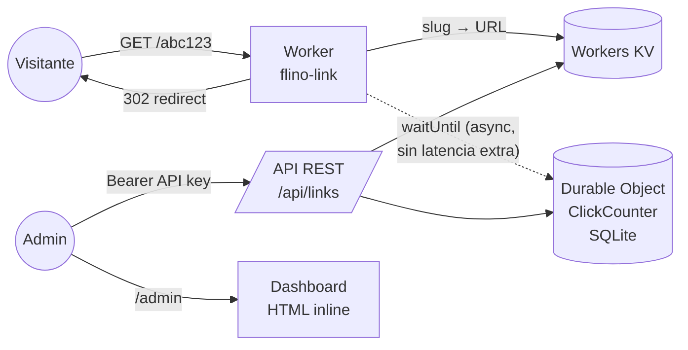

# flino.link

Acortador de URLs personal, corriendo en producción sobre la red edge de
Cloudflare. Cada link se sirve en `flino.link/<slug>`; la raíz y los slugs
desconocidos redirigen a [flino.dev](https://flino.dev).

**Demo:** https://flino.link/dev

|                       |                                                          |
| --------------------- | -------------------------------------------------------- |
| Latencia de redirect  | < 10 ms desde 300+ ubicaciones edge                      |
| Servidores            | 0 (serverless puro, sin cold starts perceptibles)        |
| Costo de operación    | $0/mes de infraestructura · $4.68/año de dominio         |
| Capacidad (tier free) | ~100.000 requests/día                                    |
| Stack                 | TypeScript · Cloudflare Workers · KV · Durable Objects   |
| Dependencias runtime  | Ninguna — sin frameworks, sin npm en producción          |



## Por qué

Dos objetivos: tener links cortos propios bajo mi marca (cada link compartido
apunta tráfico hacia `flino.dev`), y construir un sistema completo —
DNS, edge computing, storage distribuido, auth, dashboard — operando en
producción real con costo cero.

## Arquitectura



Un solo Worker atiende todo el dominio:

- **Redirects** — el camino caliente. Una lectura a KV (replicado
  globalmente, lecturas en el edge) y un `302`. Nada más toca ese camino.
- **Conteo de clicks** — un Durable Object con SQLite embebido guarda
  `slug → (count, last_click)`. El incremento va dentro de
  `ctx.waitUntil()`: se ejecuta *después* de enviar la respuesta, así que
  contar clicks añade **cero latencia** al redirect.
- **API REST** — CRUD de links con auth Bearer. La key vive como
  [secret del Worker](https://developers.cloudflare.com/workers/configuration/secrets/),
  nunca en el repo.
- **Dashboard** (`/admin`) — una sola página HTML servida inline desde el
  Worker: crear links, copiar, borrar y ver clicks por link. Sin framework,
  sin build step, dark mode automático.

## Decisiones de diseño

**KV para los links, Durable Object para los contadores.** KV es ideal para
el patrón "muchas lecturas, pocas escrituras" de un acortador, pero sus
escrituras son eventualmente consistentes — inservibles para contar. Un
Durable Object da un punto único de consistencia con SQLite transaccional,
y en el camino de lectura no estorba porque el conteo es asíncrono.

**Dominio dedicado en vez de rutas bajo flino.dev.** Los acortadores
atraen abuso (spam, phishing) y terminan en blocklists. Con un dominio
separado, esa reputación de riesgo queda aislada de mi sitio principal.

**Slugs aleatorios de 6 caracteres base62** (~57 mil millones de
combinaciones) generados con `crypto.getRandomValues`, con opción de slug
personalizado. Slugs reservados (`api`, `admin`, …) no son asignables.

**Fallo cerrado hacia la marca.** Slug inexistente o raíz → redirect a
`flino.dev`. Un link roto nunca muestra un error; muestra mi sitio.

## API

Autenticación: header `Authorization: Bearer <API_KEY>`.

```sh
# Crear link (slug aleatorio)
curl -X POST https://flino.link/api/links \
  -H "Authorization: Bearer $API_KEY" \
  -d '{"url":"https://ejemplo.com/pagina-larga"}'
# → { "slug": "pQ4xhx", "url": "…", "shortUrl": "https://flino.link/pQ4xhx" }

# Crear link con slug propio
curl -X POST https://flino.link/api/links \
  -H "Authorization: Bearer $API_KEY" \
  -d '{"url":"https://github.com/usuario","slug":"gh"}'

# Listar todos (incluye clicks y último click)
curl -H "Authorization: Bearer $API_KEY" https://flino.link/api/links

# Consultar / borrar
curl -H "Authorization: Bearer $API_KEY" https://flino.link/api/links/gh
curl -X DELETE -H "Authorization: Bearer $API_KEY" https://flino.link/api/links/gh
```

## Desarrollo

```sh
npm install
npm run dev          # usa la API_KEY de .dev.vars (no versionado)
```

## Despliegue (una sola vez)

1. En Cloudflare: añadir el sitio `flino.link` y activar la zona
   (cambiar los nameservers del registrar a los que indique Cloudflare).
2. `npx wrangler login`
3. `npx wrangler kv namespace create LINKS` y copiar el `id` resultante
   en `wrangler.jsonc`.
4. `npx wrangler secret put API_KEY` (elegir una clave larga y aleatoria,
   p. ej. `openssl rand -hex 32`).
5. `npm run deploy`

Despliegues posteriores: solo `npm run deploy`.

## Posibles extensiones

- Analytics más ricos (país, referrer) con Workers Analytics Engine
- Expiración de links (TTL nativo de KV)
- Email en `@flino.link` vía Cloudflare Email Routing
