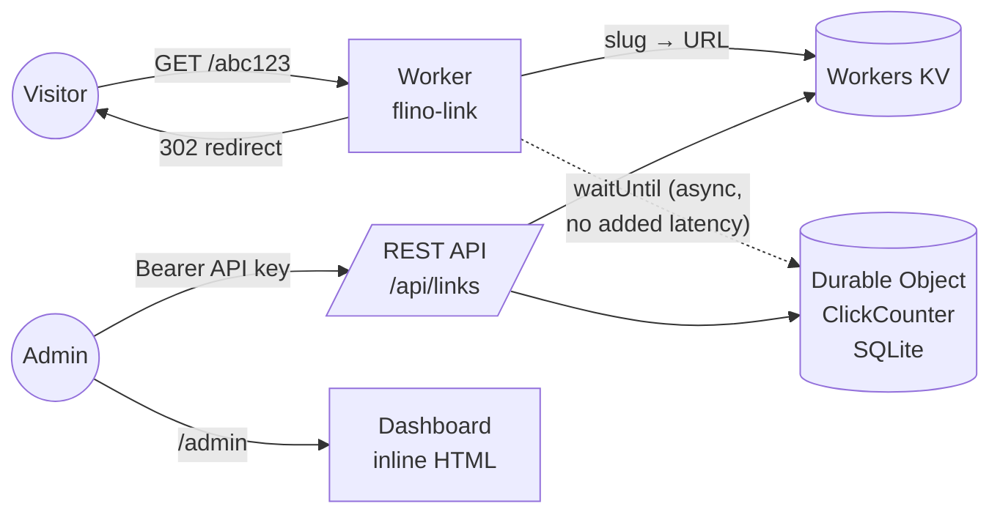

# flino.link

> 🇪🇸 [Versión en español](README.es.md)

Personal URL shortener running in production on Cloudflare's edge network.
Links are served at `flino.link/<slug>`; the root and unknown slugs redirect
to [flino.dev](https://flino.dev).

**Demo:** https://flino.link/me

|                        |                                                          |
| ---------------------- | -------------------------------------------------------- |
| Redirect latency       | < 10 ms from 300+ edge locations                         |
| Servers                | 0 (pure serverless, no perceptible cold starts)          |
| Operating cost         | $0/mo infrastructure · $4.68/yr domain                   |
| Capacity (free tier)   | ~100,000 requests/day                                    |
| Stack                  | TypeScript · Cloudflare Workers · KV · Durable Objects   |
| Runtime dependencies   | None — no frameworks, no npm in production               |


## Why

Two goals: short links under my own brand (every shared link points traffic
back to `flino.dev`), and building a complete system — DNS, edge computing,
distributed storage, auth, dashboard — running in real production at zero
cost.

## Architecture



A single Worker serves the whole domain:

- **Redirects** — the hot path. One KV read (globally replicated, served
  from the edge) and a `302`. Nothing else touches that path.
- **Click counting** — a Durable Object with embedded SQLite stores
  `slug → (count, last_click)`. The increment runs inside
  `ctx.waitUntil()`: it executes *after* the response is sent, so counting
  clicks adds **zero latency** to the redirect.
- **REST API** — link CRUD with Bearer auth. The key lives as a
  [Worker secret](https://developers.cloudflare.com/workers/configuration/secrets/),
  never in the repo.
- **Dashboard** (`/admin`) — a single HTML page served inline from the
  Worker: create links, copy, delete, and see clicks per link. No
  framework, no build step, automatic dark mode.

## Design decisions

**KV for links, a Durable Object for counters.** KV is ideal for a
shortener's read-heavy, write-light pattern, but its writes are eventually
consistent — useless for counting. A Durable Object provides a single
point of consistency with transactional SQLite, and it stays out of the
read path because counting is asynchronous.

**A dedicated domain instead of routes under flino.dev.** Shorteners
attract abuse (spam, phishing) and end up on blocklists. With a separate
domain, that reputation risk stays isolated from my main site.

**Random 6-character base62 slugs** (~57 billion combinations) generated
with `crypto.getRandomValues`, with optional custom slugs. Reserved slugs
(`api`, `admin`, …) cannot be assigned.

**Fail toward the brand.** Unknown slug or root → redirect to
`flino.dev`. A broken link never shows an error; it shows my site.

## API

Authentication: `Authorization: Bearer <API_KEY>` header.

```sh
# Create a link (random slug)
curl -X POST https://flino.link/api/links \
  -H "Authorization: Bearer $API_KEY" \
  -d '{"url":"https://example.com/some-long-page"}'
# → { "slug": "pQ4xhx", "url": "…", "shortUrl": "https://flino.link/pQ4xhx" }

# Create a link with a custom slug
curl -X POST https://flino.link/api/links \
  -H "Authorization: Bearer $API_KEY" \
  -d '{"url":"https://github.com/someuser","slug":"gh"}'

# List all links (includes clicks and last click)
curl -H "Authorization: Bearer $API_KEY" https://flino.link/api/links

# Get / delete
curl -H "Authorization: Bearer $API_KEY" https://flino.link/api/links/gh
curl -X DELETE -H "Authorization: Bearer $API_KEY" https://flino.link/api/links/gh
```

## Development

```sh
npm install
npm run dev          # uses the API_KEY from .dev.vars (not versioned)
```

## Deployment (one-time setup)

1. In Cloudflare: add the `flino.link` site and activate the zone
   (point the registrar's nameservers to the ones Cloudflare assigns).
2. `npx wrangler login`
3. `npx wrangler kv namespace create LINKS` and copy the resulting `id`
   into `wrangler.jsonc`.
4. `npx wrangler secret put API_KEY` (pick a long random key,
   e.g. `openssl rand -hex 32`).
5. `npm run deploy`

Subsequent deploys: just `npm run deploy`.

## Possible extensions

- Richer analytics (country, referrer) with Workers Analytics Engine
- Link expiration (native KV TTL)
- Email at `@flino.link` via Cloudflare Email Routing
